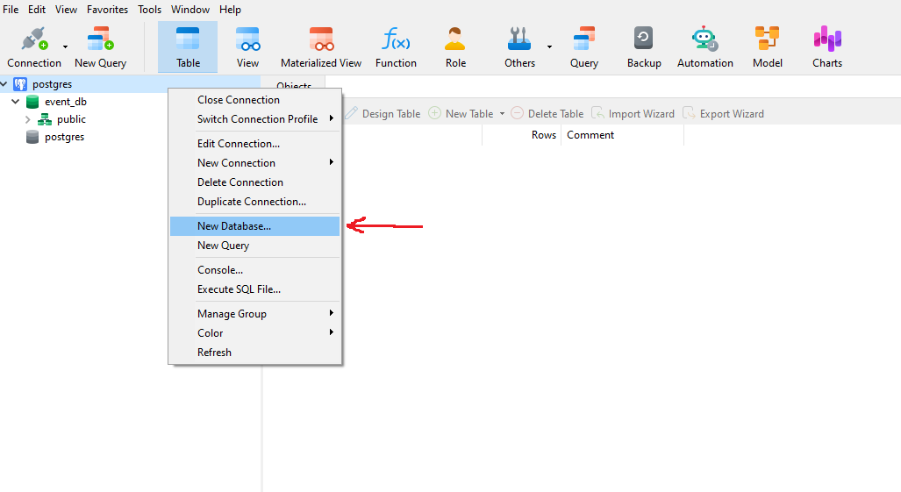
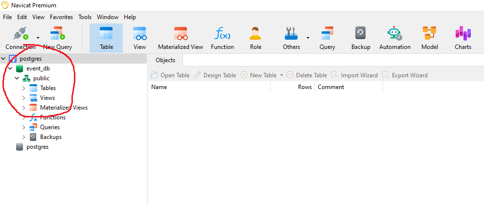

# EventStudio Backend using Express.js and PostgreSQL

## Installation
1. Clone the repo

```bash
git clone https://github.com/jamiels/eventstudio.git
cd backend
```
2. Install the dependencies

```bash
npm install
```

3. Install Nodemon

```bash
npm install -g nodemon
```


## Pre-requisite
### 1. A running PostgreSQL Server
You have to download and install PostgreSQL.

`https://www.enterprisedb.com/downloads/postgres-postgresql-downloads`

You can change the Postgres User and Password configuration on the "config/db.config.js" file like below.
```
User = postgres
Password = 123
```

### 2. An empty DB on the PostgreSQL

Create new Database on PostgreSQL ("event_db")

You can use this Command
```
CREATE DATABASE "event_db";
```
Or use DB management application.


 | 


### 3. A running Node.js Server
#### `node` and `npm` installed


## Getting Started
Here is what you need to get it up and running:

#### A free `8080` PORT (you may change the port in `server.js`)


## How to run
You are now ready to start the API Server.

```bash
npm start
```
