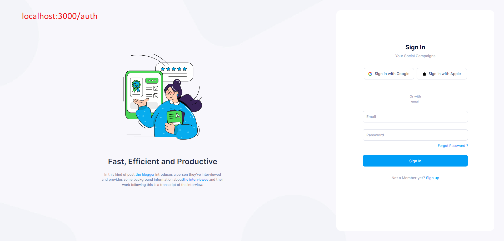
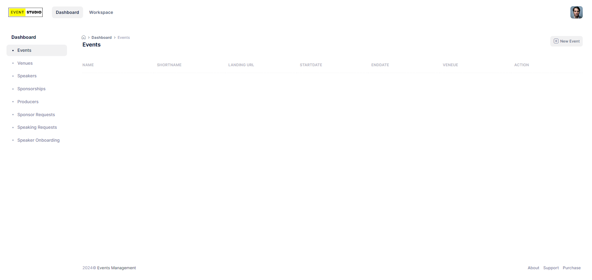
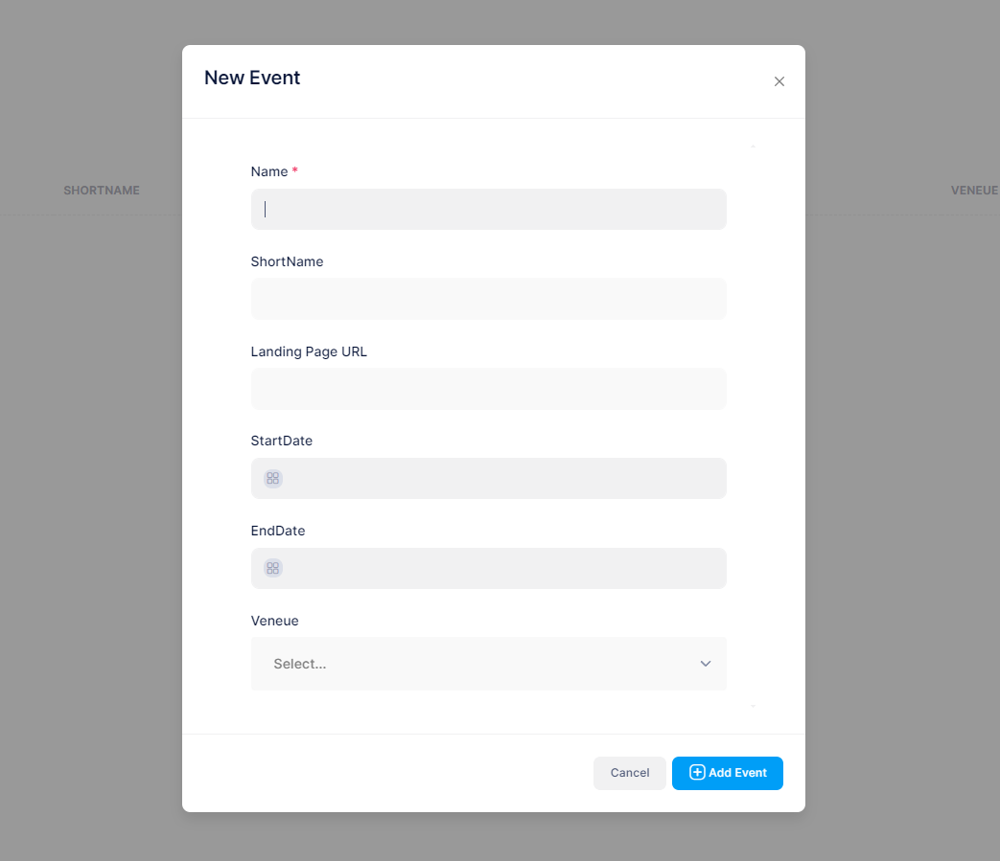
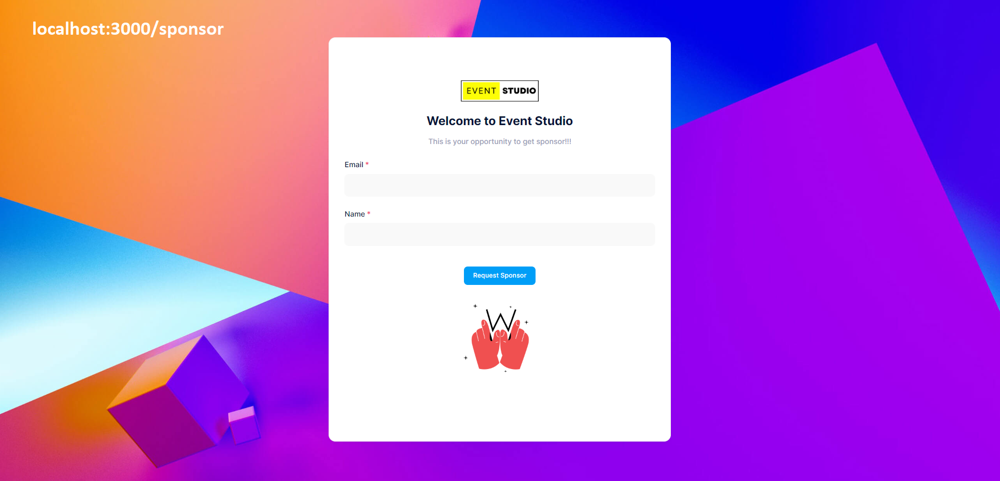

# EventStudio Frontend React App

## Installation
1. Clone the repo

```bash
git clone https://github.com/jamiels/eventstudio.git
cd frontend
```
2. Install the dependencies

```bash
npm install
```
or
```bash
npm install --force
```

## How to run
You are now ready to start the React Frontend server.

```bash
npm start
```

Runs the app in the development mode.\
Open [http://localhost:3000](http://localhost:3000) to view it in your browser.

The page will reload when you make changes.\
You may also see any lint errors in the console.

## Guide for Frontend

### 1. Login and Register Page
URL : `localhost:3000/auth`

 | 

### 2. Event Dashboard Page
URL : `localhost:3000`



### 3. New Event Modal



### 4. Sponsor Request page (Without authrization)
URL : `localhost:3000/public/sponsor`


